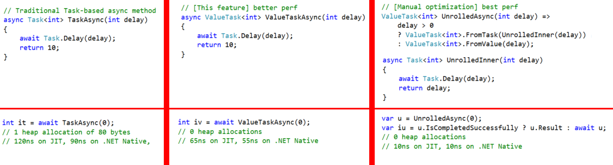

# C# feature proposal: arbitrary async returns

In C#6, async methods must return either `void` or `Task` or `Task<T>`. This proposed feature allows them to return any *tasklike* type.

> * **TRY IT OUT ONLINE:** [tryroslyn.azurewebsites.net](http://is.gd/Yjvb2P)
> * **Download:** [ArbitraryAsyncReturns.zip](https://github.com/ljw1004/roslyn/raw/features/async-return/ArbitraryAsyncReturns.zip) [22mb]
> * **Install:** Unzip the file. Quit VS. Double-click to install in this order: (1) Roslyn.VisualStudio.Setup.vsix, (2) Roslyn.Compilers.Extension.vsix, (3) ExpressionEvaluatorPackage.vsix. I don't think the others are needed.
> * **Test:** the zip file contains a sample project
> * **Uninstall:** I've usually been able to go to within Visual Studio to Tools>Extensions, search for Roslyn, and uninstall in the order (1) Expression Evaluators, (2) Compilers, (3) Language Service. Once that resulted in a broken VS that was unable to load C# projects, and I unbroke it by deleting the entire folder `%userprofile%\AppData\Roaming\Microsoft\VisualStudio` and `%userprofile%\AppData\Local\Microsoft\VisualStudio`. Doing so reset all my VS settings to default.
> * **Watch:** I coded this prototype live in livecoding.tv, and you can watch recordings if you want: [livecoding.tv/ljw1004](https://www.livecoding.tv/ljw1004/)
> * **Discuss:** please read the [Design rationale and alternatives](feature - arbitrary async returns - discussion.md), and then go to the [discussion thread](https://github.com/dotnet/roslyn/issues/10902)


The primary benefit is to allow a `ValueTask<T>` that reduces the "async overhead cost" on the hot path:

* Such a `ValueTask<T>` has already been checked into corefx ([corefx#4857](https://github.com/dotnet/corefx/pull/4857))
* Some teams decide the perf benefits of `ValueTask<T>` are so great that they're worth the cumbersome manual code you have to write today (rightmost column) -- e.g. `System.Xml` ([corefx#4936](https://github.com/dotnet/corefx/pull/4936)), which had previously been using an internal form of `ValueTask`.
* Other teams decide that the cumbersome code is so ugly they're willing to forego the perf benefits for now, at least until the C# compiler gets support for `ValueTask<T>` -- e.g. ASP.NET FormReader ([aspnet#556](https://github.com/aspnet/HttpAbstractions/pull/556#issuecomment-199974553)). Using `ValueTask<T>` would have gotten memory down from 440MB to 0.5MB in the test reported in that thread.
* I believe most folks will continue to use `Task<T>` most of the time, just like they don't bother with `.ConfigureAwait(false)` most of the time. That's because `Task` has so many nice combinators.

> (This feature proposal merely allows the middle column, to remove the necessity of heap allocation and to improve perf somewhat. Could we build upon this feature proposal to allow the rightmost column, with additional compiler unrolling to achieve optimum perf? It seems hard because the unrolled version has different semantics aroud context-capture, and the incremental perf wins seem comparitively minor. See [issue#10449](https://github.com/dotnet/roslyn/issues/10449).)


The secondary benefit is to allow async methods to return other domain-specific tasklike values. Here are some examples:
```csharp
// IAsyncAction in Windows programming. Today you write wrapper code like this:
//    IAsyncAction TestAsync(int p, int q) => TestAsyncInner(p, q).AsAsyncAction();
//    async Task TestAsyncInner(int p, int q) { ... }
// It would be neater if you could just return directly:
async IAsyncAction TestAsync(int p, int q) { ... }

// ITask<out T>. The Task that we're forced to use today is invariant. Sometimes you want covariance:
async ITask<string> TestAsync() { ... }
ITask<object> = TestAsync();

// IObservable. Today you write wrapper code like this:
//    IObservable<int> TestAsync(int p, int q) => TestAsyncInner(p,q).ToObservable();
//    async Task<int> TestAsyncInner(int p, int q) { ... }
// It would be neater if you could just return directly:
async IObservable<int> TestAsync(int p, int q) { ... }
```
Actually that `IObservable` example is still up for discussion. It's not clear whether `IObservable` would prefer to be like an async method or an async enumerable method. We need to hear from `IObservable` experts.


A third "benefit" (it's arguable whether this is a benefit at all) is that people will be able to weave hooks into their async methods, for instance to call into their own function before and after every cold-path await:
```csharp
async InstrumentedTask TestAsync()
{
    await InstrumentedTask.Configure(actionBeforeEachAwait, actionAfterEachAwait);
    await Task.Delay(10);
	await Task.Delay(20);
}
```


# Proposal

Define:
* A *non-generic tasklike* is any non-generic type with a single public static method `CreateAsyncMethodBuilder()`, or the type `System.Threading.Tasks.Task`.
* A *generic tasklike* is any generic type with arity 1 with the same method, or the type `System.Threading.Tasks.Task<T>`.

The rules for [async functions](https://github.com/ljw1004/csharpspec/blob/gh-pages/classes.md#async-functions) currently allow an async method to return either `void` or `Task` or `Task<T>`; this will be changed to allow it to return either `void`, or any non-generic `Tasklike`, or generic `Tasklike<T>`.

The rules for [evaluation of task-returning async functions](https://github.com/ljw1004/csharpspec/blob/gh-pages/classes.md#evaluation-of-a-task-returning-async-function) currently talk in general terms about "generating an instance of the returned task type" and "initially incomplete state" and "moved out of the incomplete state". These will be changed to spell out how that returned tasklike is constructed and how its state is transitioned, as detailed below.

The overload resolution rules for [better function member](https://github.com/ljw1004/csharpspec/blob/gh-pages/expressions.md#better-function-member) currently say that if neither candidate is better, and also the two applicable candidates have identical parameter types `{P1...Pn}` and `{Q1...Qn}` then we attempt  tie-breakers to determine which is the better one, otherwise it is an ambiguity error. With this feature, this will be modified so that if neither candidate is better and also the parameter types are identical *up to tasklikes* then attempt the tie-breakers: in other words, for purposes of this identity comparison, all non-generic `Tasklike`s are deemed identical to each other, and all generic `Tasklike<T>`s for a given `T` are deemed identical to each other.

> For explanation of why the proposal is this way, and to see alternatives, please read the [Design rationale and alternatives](feature - arbitrary async returns - discussion.md).

The rules for [anonymous function conversion](https://github.com/ljw1004/csharpspec/blob/gh-pages/conversions.md#anonymous-function-conversions) currently allow an async lambda to be converted to a delegate type whose return type is either `void` or `Task` or `Task<T>`; this will be changed to let them return `void` or any non-generic `Tasklike` or any generic `Tasklike<T>`.

The [inferred return type](https://github.com/ljw1004/csharpspec/blob/gh-pages/expressions.md#inferred-return-type) of a lambda expression currently takes into account the parameter types of the delegate to which the lambda is being converted. With this feature, the inferred return type of an async lambda now also takes into account the return type of that delegate:
* If the async lambda has inferred *result type* `void`:
  * if the return type of the delegate is `U` where `U` is a non-generic tasklike, then the inferred *return type* is `U`
  * otherwise the inferred *return type* is `Task`
* Otherwise, the async lambda has inferred *result type* `V1`:
  * if the return type of the delegate is `U<V2>` where `U` is a generic tasklike, then the inferred *return type* is `U<V1>`
  * otherwise the inferred *return type* is `Task<V2>`


**Semantics for execution of an async method**

The *builder type* of a tasklike is the return type of the static method `CreateAsyncMethodBuilder()` on that tasklike. (Except: if the tasklike is `System.Threading.Tasks.Task` then the builder type is `System.Runtime.CompilerService.AsyncTaskMethodBuilder`; and if the tasklike is `System.Threading.Tasks.Task<T>` then the builder type is `System.Runtime.CompilerService.AsyncTaskMethodBuilder<T>`).

When an async tasklike-returning method is invoked,
* It creates `var sm = new CompilerGeneratedStateMachineType()` where this compiler-generated state machine type represents the async tasklike method, and may be a struct or a class, and has a field `BuilderType builder` in it, and implements `IAsyncStateMachine`.
* It assigns `sm.builder = Tasklike.CreateAsyncMethodBuilder()` to create a new instance of the builder type. (Except: if the tasklike is `Task` or `Task<T>`, then the assignment is instead `sm.builder = BuilderType.Create()`.)
* It then calls the `void Start<TSM>(ref TSM sm) where TSM : IAsyncStateMachine` method on `builder`. It is an error if this instance method doesn't exist or isn't public or has a different signature or constraints. The `sm` variable is that same `sm` as was constructed earlier. Upon being given this `sm` variable, the builder must invoke `sm.MoveNext()` on it exactly once, either now in the `Start` method or in the future. 
* It then retrieves the `U Task {get;}` property on `sm.builder`. The value of this property is then returned from the async method. It is an error if this instance property doesn't exist or isn't public or if its property type `U` isn't identical to the return type of the async tasklike-returning method.

Execution of `sm.MoveNext()` might cause other builder methods to be invoked:
* If the async method completes succesfully, it invokes the method `void SetResult()` on `sm.builder` (in case of a non-generic tasklike), or the `void SetResult(T result)` method with the operand of the return statement (in case of a generic tasklike). It is an error if this instance method doesn't exist or isn't public.
* If the async method fails with an exception, it invokes the method `void SetException(System.Exception ex)` on `sm.builder`. It is an error if this instance method doesn't exist or isn't public.
* If the async method executes an `await e` operation, it invokes `var awaiter = e.GetAwaiter()`.
  * If this awaiter implements `ICriticalNotifyCompletion` and the `IsCompleted` property is false, then it calls the method `void AwaitUnsafeOnCompleted<TA,TSM>(ref TA awaiter, ref TSM sm) where TA : ICriticalNotifyCompletion where TSM : IAsyncStateMachine` on `sm.builder`. It is an error if this instance method doesn't exist or isn't public or has the wrong constraints. The builder is expected to call `awaiter.UnsafeOnCompleted(action)` with some `action` that will cause `sm.MoveNext()` to be invoked once; or, instead, the builder may call `sm.MoveNext()` once itself.
  * If this awaiter implements `INotifyCompletion` and the `IsCompleted` property is false, then it calls the method `void AwaitOnCompleted<TA,TSM>(ref TA awaiter, ref TSM sm) where TA : INotifyCompletion where TSM : IAsyncStateMachine` on `sm.builder`. It is an error if this instance method doesn't exist or isn't public or has the wrong constraints. Again the builder is expected to call `awaiter.OnCompleted(action)` similarly, or call `sm.MoveNext()` itself.

In the case where the builder type is a struct, and `sm` is also a struct, it's important to consider what happens should the builder decide to *box* the struct, e.g. by doing `IAsyncStateMachine boxed_sm = sm`. This will always create a new copy of `sm`, which will in turn contain a new copy of `sm.builder`.
* The builder is at liberty anytime to call `boxed_sm.SetStateMachine(boxed_sm)`. This will invoke the `void SetStateMachine(IAsyncStateMachine boxed_sm)` method on `boxed_sm.builder`. It is an error if this instance method doesn't exist or isn't public.
* This mechanism is typically used by struct builder types so they can box only once the `sm` parameter they receive in their `Start` or `AwaitOnCompleted` or `AwaitUnsafeOnCompleted` methods; on subsequent calls, they ignore that parameter and used the version they have already boxed. 

There's one final requirement:
* The Visual Studio IDE might invoke the method `builder.GetCompletionActions()`, where the return type must either implement `System.Threading.Tasks.Task` or be `Action[]`. It is an error if this instance method doesn't exist or doesn't have the right return type.
  * The IDE calls this in order to display an "async callstack".
  * The idea is that if someone had retrieved the property `var tasklike = builder.Task`, and then called `tasklike.OnCompleted(action)` or `tasklike.UnsafeOnCompleted(action)`, then the IDE needs to be able to get a list of all those `action`s which are still pending.
  * It's common for tasklike types to use a `System.Threading.Tasks.Task` under the hood. We don't have any way to extract the list of actions out of one, but the IDE does, and if you return an object of type `Task` then the IDE will use its techniques to extract those actions and display the callstack.
  * If you return `null` from this method, then the IDE will never be able to display async callstacks beyond the point of an async tasklike-returning method. This will make users unhappy.


## Compilation notes and edge cases

**Concrete tasklike**. The following kind of thing is conceptually impossible, because the compiler needs to know the *concrete* type of the tasklike that's being constructed (in order to construct it).
```cs
class C<T> where T : MyTasklike {
    async T f() { } // error: the return type must be a concrete type
}
```

**Incomplete builder**. The compiler should recognize the following method `f` as an async method that doesn't need a return statement, and should bind it accordingly. There is nothing wrong with the `async` modifier nor the absence of a `return` keyword. The fact that `MyTasklike`'s builder doesn't fulfill the pattern is an error that comes later on: it doesn't prevent the compiler from binding method `f`.
```cs
class C { async MyTasklike f() { } }
class MyTasklike { public static string CreateAsyncMethodBuilder() => null; }
```

If the builder doesn't fulfill the pattern, well, that's an edge case. It should definitely give errors (like it does today e.g. if you have an async Task-returning method and target .NET4.0), but it doesn't matter to have high-quality errors (again it doesn't have high quality errors today). One unusual case of failed builder is where the builder has the wrong constraints on its generic type parameters. As far as I can tell, constraints aren't taken into account elsewhere in the compiler (the only other well known methods with generic parameters are below, and they're all in mscorlib, so no chance of them ever getting wrong)
```
System.Array.Empty
System_Runtime_InteropServices_WindowsRuntime_WindowsRuntimeMarshal__AddEventHandler_T
System_Runtime_InteropServices_WindowsRuntime_WindowsRuntimeMarshal__RemoveEventHandler_T
System_Activator__CreateInstance_T
System_Threading_Interlocked__CompareExchange_T
Microsoft_VisualBasic_CompilerServices_Conversions__ToGenericParameter_T_Object
```

# Design rationale and alternatives

For explanation of why the proposal is this way, and to see alternatives, please read the [Design rationale and alternatives](feature - arbitrary async returns - discussion.md).
